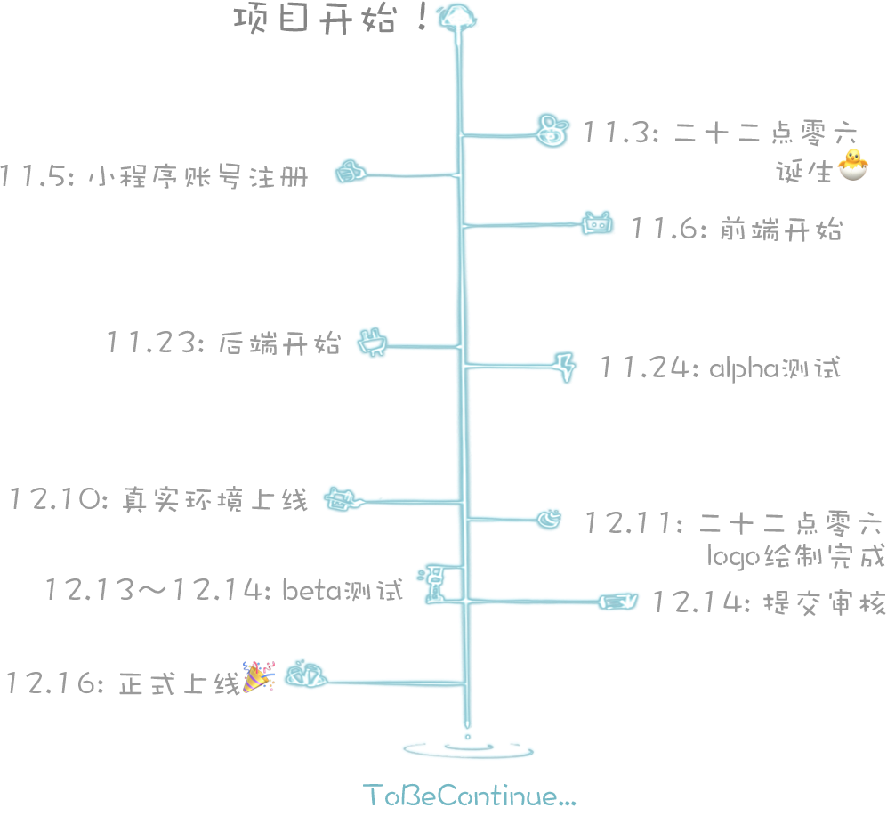
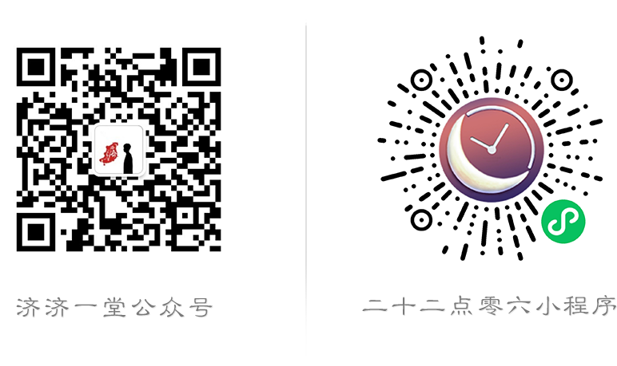

<h1 align="center">二十二点零六</h1>

 

 

## ❤️‍🔥遇见22:06

 

## 关于我们

### 大包子

| - **学历**：同济大学软件学院本科生，北京大学信息工程学院硕士研究生  - **分工**：项目发起人、PM、前后端数据库测试全栈  - **个人邮箱**：[doublez@alumni.tongji.edu.cn](mailto:doublez@alumni.tongji.edu.cn)  - **想说的话**：以这种特殊的方式告别同济，希望在这里能见证很多遇见，记得每晚都会有🌙 |  |
| :----------------------------------------------------------- | :----------------------------------------------------------: |

### 大包子

- **学历**：同济大学软件学院本科生，北京大学信息工程学院硕士研究生
- **分工**：项目发起人、PM、前后端数据库测试全栈
- **个人邮箱**：[doublez@alumni.tongji.edu.cn](mailto:doublez@alumni.tongji.edu.cn)
- **想说的话**：以这种特殊的方式告别同济，希望在这里能见证很多遇见，记得每晚都会有🌙

### 嘟噜嘟噜啪

- **学历**：同济大学软件学院本科生 & 硕士研究生
- **分工**：我只是一个毫无感情的美术
- **个人邮箱**：[sternstarry18@gmail.com](mailto:sternstarry18@gmail.com)
- **想说的话**：在想留下痕迹和想了无痕迹的矛盾里，推搡着来到了这里，期待着体会与我不相干的悲喜
- **碎碎念**：时刻怀疑我自己程序猿的身份...

 

## 时间轴

 

## 联系方式

- **邮箱**：[Six_past_TwentyTwo@163.com](mailto:Six_past_TwentyTwo@163.com)
- **Github**：[https://github.com/doubleZ0108/Six-past-Twenty-Two](https://github.com/doubleZ0108/Six-past-Twenty-Two)
- **doubleZ的个人网站**：[https://www.doublez.site](https://www.doublez.site)

Copyright © Tongji Univ. SSE Six past Twenty Two All Right Reserved.

